# Kiln 测试指南

> 本文档是 Kiln 项目的**测试方法论**。
>
> - 和 [`design.md`](./design.md) Ch 16 的关系:那边是"选什么栈",本文是"**怎么用、什么时候用、用在哪一层**"。
> - 和 [`CLAUDE.md`](../CLAUDE.md) 的 TDD 章节的关系:CLAUDE.md 是项目约定(规则条文),本文是这些规则**背后的原理 + 实操模板
    **。
> - 适用对象:新加入 Kiln 项目的工程师、外部贡献者、以及使用 Agent Teams 完成 Phase 的 Claude。

## 核心信息

| 项         | 值                                                                                |
|-----------|----------------------------------------------------------------------------------|
| 哲学        | 金字塔形测试分布 + Hexagonal 分层驱动 + 4-gate Phase 流程                                      |
| 主力栈       | JUnit 5.13+ / AssertJ 3.26+ / Mockito 5.14+ / Testcontainers 1.21.3              |
| Spring 测试 | `@WebMvcTest` / `@DataJooqTest` slice + `@SpringBootTest` + `@ServiceConnection` |
| 架构验证      | ArchUnit 1.3(Hexagonal 层界)+ Spring Modulith 2.0(模块边界)                            |
| 质量度量      | JaCoCo 0.8.12(行/分支覆盖)+ PIT 1.15(mutation)                                        |
| TDD 强度    | Strict Red-Green-Refactor for any class with behavior;skeletons exempt           |
| 4-gate 流程 | **Gate 1** TDD 绿 → **Gate 2** review → **Gate 3** fix-all → **Gate 4** commit    |

---

## 目录

1. [哲学与基本原则](#1-哲学与基本原则)
2. [测试的三个维度](#2-测试的三个维度)
3. [Kiln 专属的测试金字塔](#3-kiln-专属的测试金字塔)
4. [按 Hexagonal 层的测试策略](#4-按-hexagonal-层的测试策略)
5. [TDD 工作流](#5-tdd-工作流)
6. [4-gate 与测试的关系](#6-4-gate-与测试的关系)
7. [工具栈选型表](#7-工具栈选型表)
8. [Unit 测试模式](#8-unit-测试模式)
9. [Slice 测试模式](#9-slice-测试模式)
10. [Integration 测试模式](#10-integration-测试模式)
11. [架构测试](#11-架构测试)
12. [契约测试](#12-契约测试)
13. [覆盖率与质量度量](#13-覆盖率与质量度量)
14. [性能 & 安全测试](#14-性能-安全测试)
15. [反模式清单](#15-反模式清单)
16. [按 Phase 的测试引入时间表](#16-按-phase-的测试引入时间表)
17. [FAQ 与常见故障](#17-faq-与常见故障)

---

## 1. 哲学与基本原则

### 1.1 七条硬规矩

1. **测试是第一等公民,不是"补的"** — 每个有行为的类都必须有一个先失败的测试,否则不进 main。
2. **金字塔形状** — unit 多、integration 少、e2e 更少。倒金字塔(大量 e2e 压住一两个 unit)= 慢 + 脆弱。
3. **每种测试只捕它擅长捕的 bug** — domain 的分支逻辑用 unit 测,别去 integration 里测;DB 的 UPSERT 语义用 Testcontainers
   测,别在 unit 里 mock jOOQ。
4. **测试代码也是代码** — 有代码异味的测试 = 技术债。Code review 时测试文件和生产代码同等审查。
5. **没跑过的绿测试 = 没测试** — 覆盖率(JaCoCo)告诉你代码真的被执行了。
6. **没 kill 过 mutation 的绿测试 = 形式主义** — 用 PIT 检查你的断言是否真的**区分**对错。
7. **架构边界必须靠工具强制,不靠人自觉** — ArchUnit + Spring Modulith `verify()` 每次构建都跑。

### 1.2 什么时候不写测试

三类情况**豁免** TDD:

- `package-info.java` 占位
- `@SpringBootApplication` 入口类(纯启动,无行为)
- Marker annotations(`@RawResponse` 等无方法的注解)

规则**激活的瞬间**:类里出现 `if`、`throw`、factory method、边界 clamp、状态变更 — 任何断言得出来的行为。

### 1.3 一个决策问题

遇到"这个东西该不该加测试"时问:

- "如果这行代码被删掉 / 改错,会有 bug 吗?" → 是 = 写测试
- "这个测试 fail 时,我能指出哪行实现代码错了吗?" → 不能 = 测试写得太粗,或者是在测框架而不是测业务

---

## 2. 测试的三个维度

很多"测试类型"的术语混在一起,是因为它们分别在**三个不同的维度**上。分清楚再讨论:

### 维度 A:范围(纵向)

| 范围              | 一次测什么                       | 成本  | 示例                                                    |
|-----------------|-----------------------------|-----|-------------------------------------------------------|
| **Unit**        | 一个类,无 Spring context        | 毫秒级 | `UserTest`、`MoneyTest`、`Argon2idPasswordServiceTest`  |
| **Slice**       | 部分 Spring context(一层)       | 秒级  | `@WebMvcTest UserController`、`@DataJooqTest`          |
| **Integration** | 全栈 + 真实外部依赖(Testcontainers) | 十秒级 | `UserJooqRepositoryAdapterTest`、`KilnIntegrationTest` |
| **E2E / 验收**    | 端到端用户旅程(可跨服务)               | 分钟级 | `KilnIntegrationTest` 的 register→login→authed-GET 串   |

### 维度 B:目的(你**想测**什么)

| 目的        | 问题                              |
|-----------|---------------------------------|
| **功能正确**  | 给定输入,产出正确吗?                     |
| **架构约束**  | 依赖方向对吗?模块边界守住了吗?                |
| **并发安全**  | 多线程下状态一致吗?                      |
| **性能基线**  | 响应时间 / 吞吐量在可接受范围?               |
| **安全不变式** | 枚举攻击 / timing / 日志注入 / 密码明文不泄漏? |
| **契约兼容**  | 外部 API / DB schema 没破坏性变更?      |
| **可观测性**  | 预期的日志 / 指标 / trace 真的被打了?       |

### 维度 C:执行策略(**怎么跑**)

| 策略                 | 定义               | 工具                                |
|--------------------|------------------|-----------------------------------|
| **TDD**            | 写代码前先写测试(红→绿→重构) | 见第 5 节                            |
| **Smoke**          | 最低成本的"能启动吗"      | `contextLoads` + actuator /health |
| **Regression**     | 为复现过的 bug 留下的测试  | 正常 unit/integration               |
| **Coverage**       | 量化代码被执行的比例       | JaCoCo                            |
| **Mutation**       | 量化测试能**发现**错误的比例 | PIT                               |
| **Property-based** | 成千上万随机输入验证不变式    | jqwik                             |
| **Fuzz**           | 畸形/恶意输入抗性        | Jazzer(Phase 6+)                  |
| **Load / Stress**  | 高并发下行为稳定吗        | k6 / Gatling / JMH                |
| **Chaos**          | 故障注入下韧性          | Chaos Monkey(Phase 7+)            |

**很重要的区分**:你提到的 "TDD、单元测试、覆盖率测试、集成测试、冒烟测试" — 其中 TDD / coverage / smoke 是**策略**,unit /
integration 是**范围**,"覆盖率测试"严格说不是一种测试,是给测试打分的**工具**。把它们画进金字塔会得出错误结论。

---

## 3. Kiln 专属的测试金字塔

### 3.1 目标分布

```
                      ┌──────────┐
                      │   E2E    │        ~5% 测试量
                      │  (跨模块) │     高价值、低频率
                      └──────────┘
                   ┌────────────────┐
                   │  Integration   │     ~15% 测试量
                   │ (Testcontainers)│    真 DB / Redis / HTTP
                   └────────────────┘
                ┌──────────────────────┐
                │        Slice         │   ~20% 测试量
                │ (@WebMvcTest / jOOQ) │   局部 Spring context
                └──────────────────────┘
         ┌───────────────────────────────────┐
         │              Unit                  │   ~60% 测试量
         │     (JUnit + AssertJ + Mockito)    │   毫秒级,海量
         └───────────────────────────────────┘

         ─────────────────────────────────────────────
                横切(不计入金字塔):
                ArchUnit(Hexagonal 层界)
                Spring Modulith ModularityTest(模块边界)
                OpenAPI contract snapshot(Phase 4.1+)
```

### 3.2 目前实际分布(截至 Phase 4 终点)

```
  Unit        : 144 tests ─ 72%  (目标 60-70%)
  Slice       :  33 tests ─ 17%  (目标 15-25%)
  Integration :  23 tests ─ 12%  (目标 10-15%)
  E2E         :   0 tests ─  0%  (KilnIntegrationTest 可以视为 E2E 但仍在单进程内)
  ───────────────────────────
  合计         : 200 tests
  架构         :   3 ArchUnit + 1 Modulith = 4 横切规则
```

符合金字塔。随着业务模块增加,unit 比例会继续上升。

### 3.3 如果金字塔"倒了"会怎样

典型症状:

- **Integration 过多**:构建时间飙升(单次 >10 分钟);CI flaky(Testcontainers 偶发失败);一个改动要改 10 个 integration test
- **Unit 过少**:domain 分支逻辑走不到 → 生产 NPE
- **Slice 缺失**:DTO 序列化 bug 到 e2e 才暴露

**改正方法**:review 时强制问 — "这个 integration 能被降级到 slice 吗?slice 能降到 unit 吗?"

---

## 4. 按 Hexagonal 层的测试策略

这一节是**最实用**的。写代码的时候对着这张表找对应层。

### 4.1 Domain 层(`<bc>/domain/`)

| 属性     | 值                                                      |
|--------|--------------------------------------------------------|
| 测试范围   | **Unit only**(禁止 slice / integration)                  |
| 工具     | JUnit 5 + AssertJ。**禁用 Mockito**(domain 没有应该 mock 的依赖) |
| Spring | **禁用** `@SpringBootTest` / `@WebMvcTest` 等             |
| 覆盖率目标  | **≥ 90%**(JaCoCo 行)/ ≥ 85%(分支)                         |
| PIT 目标 | Mutation score ≥ 80%                                   |
| 覆盖重点   | 聚合不变式、值对象边界、领域事件、domain exceptions                     |
| TDD 强度 | **最强** — 每个 factory / 状态变更 / 业务方法都必须先红后绿               |

**模板**:

```java
class UserTest {
    @Test void registerNormalizesEmail() {
        User u = User.register("Alice", " Alice@Example.COM ", "hash");
        assertThat(u.email()).isEqualTo("alice@example.com");
    }

    @Test void registerRejectsBlankName() {
        assertThatThrownBy(() -> User.register("", "e@e.com", "hash"))
                .isInstanceOf(IllegalArgumentException.class);
    }
    // ... 每条不变式一个测试 ...
}
```

**禁止**:

```java
// ❌ 错 — domain 用了 Spring
@SpringBootTest class UserTest { ... }

// ❌ 错 — mock 了不可 mock 的 record
@Mock Money money;

// ❌ 错 — 测试名是"测试1"
@Test void test1() { ... }
```

### 4.2 Application / UseCase 层(`<bc>/application/usecase/`)

| 属性     | 值                                                            |
|--------|--------------------------------------------------------------|
| 测试范围   | **Unit**(Mockito 模拟所有 port)                                  |
| 工具     | JUnit + AssertJ + Mockito 5                                  |
| Spring | 不用(`@Service` 手动 `new`)                                      |
| 覆盖率目标  | ≥ 85% 行 / 75% 分支                                             |
| 覆盖重点   | 编排逻辑、`@Transactional` 语义、事件发布顺序、异常翻译(infra → app exceptions) |

**模板**(节选自 `RegisterUserServiceTest`):

```java
@ExtendWith(MockitoExtension.class)
class RegisterUserServiceTest {
    @Mock UserRepository repo;
    @Mock ApplicationEventPublisher events;
    @Mock PasswordService passwordService;

    @InjectMocks
    RegisterUserService service;

    @Test
    void duplicate_key_translated_to_conflict() {
        when(passwordService.hash(any())).thenReturn("h");
        doThrow(new DuplicateKeyException("dup")).when(repo).save(any());

        assertThatThrownBy(() -> service.execute(cmd))
                .isInstanceOf(AppException.class)
                .extracting(ex -> ((AppException) ex).appCode())
                .isEqualTo(AppCode.CONFLICT);

        verify(events, never()).publishEvent(any());   // 回滚时不发事件
    }
}
```

**典型断言维度**:

- 调用关系(`verify(repo).save(any())`)
- 事件发布顺序(事务后 vs 前)
- 异常类型 + AppCode 正确
- 参数捕获(`ArgumentCaptor` 验证传给 port 的对象内容)

### 4.3 Adapter In — Web(`<bc>/adapter/in/web/`)

| 属性     | 值                                                                           |
|--------|-----------------------------------------------------------------------------|
| 测试范围   | **Slice** (`@WebMvcTest(ControllerX.class)`)                                |
| 工具     | MockMvc + `@MockitoBean`(Spring Test 6.2+ 替代 `@MockBean`)                   |
| Spring | 最小 `@SpringBootConfiguration` + `@EnableAutoConfiguration` + component scan |
| 覆盖率目标  | ≥ 75%                                                                       |
| 覆盖重点   | `@Valid` 验证、DTO ↔ JSON 序列化、Controller → UseCase 参数透传、状态码、响应 body 形状         |

**模板**:

```java
@WebMvcTest(UserController.class)
class UserControllerTest {
    @SpringBootConfiguration
    @EnableAutoConfiguration
    @ComponentScan(basePackageClasses = UserController.class)
    static class BootConfig {}

    @MockitoBean GetUserUseCase useCase;
    @MockitoBean RegisterUserUseCase registerUseCase;
    @MockitoBean AuthenticateUserUseCase authenticateUseCase;  // 同包 auto-scan

    @Autowired MockMvc mvc;

    @Test
    void post_with_blank_name_returns_400() throws Exception {
        mvc.perform(post("/api/v1/users")
                        .contentType(MediaType.APPLICATION_JSON)
                        .content("""
                                {"name":"","email":"a@b.com","password":"S3cret-pw"}
                                """))
                .andExpect(status().isBadRequest());
    }
}
```

**注意陷阱**:

- `@SaCheckLogin` 受保护的 GET 端点**不要**在 slice 里测 — Sa-Token 拦截器不在 slice 上下文里。放 integration。
- 同一个包里的其他 Controller 会被 auto-scan — 给它们的依赖加 `@MockitoBean` 以免上下文加载失败。
- 不要用 `@Autowired ObjectMapper`(Spring Boot 4 / Jackson 3 无此 bean)— 用 text block 写原始 JSON。

### 4.4 Adapter Out — Persistence(`<bc>/adapter/out/persistence/`)

| 属性     | 值                                                                                    |
|--------|--------------------------------------------------------------------------------------|
| 测试范围   | **Integration**(Testcontainers PG)                                                   |
| 工具     | `@SpringBootTest` + `@ServiceConnection` + `PostgreSQLContainer`                     |
| Spring | 需要真 DataSource + Flyway + jOOQ auto-config                                           |
| 覆盖率目标  | ≥ 70%(wiring 代码允许未覆盖)                                                                |
| 覆盖重点   | SQL round-trip、UPSERT 语义、`DuplicateKeyException` 等异常、不变式(`upsertPreservesCreatedAt`) |

**模板**(节选自 `UserJooqRepositoryAdapterTest`):

```java
@SpringBootTest(classes = UserJooqRepositoryAdapterTest.TestApp.class)
class UserJooqRepositoryAdapterTest {
    static final String POSTGRES_IMAGE = "postgres:18.3-alpine";

    @SpringBootApplication(exclude = {
            DataRedisAutoConfiguration.class,            // 本切片不测 Redis
            SaTokenDaoForRedisTemplate.class
    })
    static class TestApp {
        @Bean @ServiceConnection
        PostgreSQLContainer<?> postgres() {
            return new PostgreSQLContainer<>(POSTGRES_IMAGE);
        }
    }

    @Autowired UserRepository repo;

    @Test
    void upsertPreservesCreatedAt() {
        User u = User.register("T", "t@x.com", "h");
        repo.save(u);
        var ts1 = dsl.select(...).fetchOne(...)

        Thread.sleep(10);
        repo.save(User.reconstitute(u.id(), "T2", "t@x.com", "h"));
        var ts2 = dsl.select(...).fetchOne(...)

        assertThat(ts2).isEqualTo(ts1);   // created_at immutable
    }

```

**关键决策**:

- **为什么不用 `@DataJooqTest` 切片**?— `@DataJooqTest` 默认不加载 `UserMapper`(不在组件扫描内),绕路再 `@Import` 让代码变复杂。
  `@SpringBootTest` + 精细 `exclude` 更清晰。
- **为什么 exclude Redis**?— 该 slice 只测持久化,Redis / Sa-Token 在这里是噪音 + 需要额外容器 + 拖慢测试。

### 4.5 Adapter Out — HTTP / Messaging

| 属性   | 值                                                   |
|------|-----------------------------------------------------|
| 测试范围 | Unit(mock HTTP client)或 Integration(WireMock / 真服务) |
| 工具   | Spring `RestClient` 测试 + WireMock stub              |
| 覆盖重点 | 序列化、错误翻译、重试、超时                                      |

**Phase 4 暂未涉及**(Phase 5+ 引入 HTTP 客户端时补)。

### 4.6 Infra 层

| 属性    | 值                                                                                                    |
|-------|------------------------------------------------------------------------------------------------------|
| 测试范围  | 混合 — 配置类 unit / Filter slice / security unit                                                         |
| 覆盖率目标 | ≥ 70%                                                                                                |
| 覆盖重点  | `Argon2idPasswordService`(安全关键,unit)、`MdcFilter`(行为,单测 + 整合)、`GlobalExceptionHandler`(异常映射表,unit 逐条) |

**Wiring-heavy 类**(如 `RedisConfig`、`SpringDocConfig`)允许较低覆盖率 — 它们主要是 `@Bean` 方法,单元测试意义有限,一次
smoke `@SpringBootTest` 装配成功就够了。

### 4.7 按层的测试矩阵总结

| 层                           | 主测试类型           | 工具                               | JaCoCo 下限 | PIT 下限 | 禁忌                       |
|-----------------------------|-----------------|----------------------------------|-----------|--------|--------------------------|
| Domain model                | Unit            | JUnit+AssertJ                    | 90%       | 80%    | ❌ Spring / Mockito       |
| Domain service              | Unit            | JUnit+AssertJ                    | 90%       | 80%    | ❌ Spring                 |
| Application usecase         | Unit            | JUnit+AssertJ+Mockito            | 85%       | 75%    | ❌ 真 DB                   |
| Application port(interface) | 无               | —                                | —         | —      | 接口本身无行为                  |
| Adapter in web              | Slice           | `@WebMvcTest`                    | 75%       | 60%    | ❌ `@SpringBootTest` 全栈   |
| Adapter in event            | Slice 或 unit    | Mockito                          | 75%       | 60%    | —                        |
| Adapter out persistence     | Integration     | Testcontainers                   | 70%       | 50%    | ❌ 无 `@ServiceConnection` |
| Adapter out http            | Unit + WireMock | WireMock / MockRestServiceServer | 70%       | 50%    | ❌ 打真第三方                  |
| Infra config                | Smoke           | `@SpringBootTest`                | 50%       | —      | —                        |
| Infra security              | Unit            | JUnit+AssertJ                    | 85%       | 75%    | ❌ 跳过 constant-time 测试    |

---

## 5. TDD 工作流

### 5.1 Red → Green → Refactor 的细节

1. **Red** — 写一条最小的、失败的测试
    - 一个 test 方法对应一个行为(不是一个方法对应一个 test)
    - 命名用业务语义(`registerNormalizesEmail`,不是 `test1`)
    - 跑它,**看它红**。没看到就是没走过 TDD。
    - Compile error **不算** red — 修掉 typo 再算。
2. **Green** — 写最少的代码让它绿
    - 不要顺手加 "while I'm here" 的功能
    - 不要加没测到的 public method
    - 跑测试 + 跑全部测试(不要破坏其他)
3. **Refactor** — 清理代码,不动行为
    - 提取公共方法、重命名变量、合并重复
    - 每一步后跑测试确认还绿
    - 不要在 red 状态下重构(你会失去 safety net)

### 5.2 新建文件 vs 修改现有文件的 TDD

| 场景        | 做法                                                                                            |
|-----------|-----------------------------------------------------------------------------------------------|
| 新类        | 先建测试文件(空 class)→ 写第一个 @Test(引用不存在的类 → 编译错)→ 让它编译错好 → 建目标类 → 写 impl 让测试 red 转绿                 |
| 修改现有类加新方法 | 先在测试文件加 `@Test foo()` 调用 `target.foo(...)` → 编译错 → 加 method signature 返回默认值 → test red → impl |
| 修 bug     | 先写一条能**重现 bug** 的测试(会 red)→ 修代码 → test 绿                                                      |

### 5.3 事后验证 TDD 合规(ctime 检查)

Subagent 自报的 "Red → Green cycles completed" **不可信**。每次 Phase 结束前:

```bash
stat -f '%B' src/test/.../FooTest.java src/main/.../Foo.java
# test_ctime 应 ≤ impl_ctime。否则:IMPL-FIRST,违规。
```

Phase 4 的 review agent 就是靠这招抓到 `AuthController` 没有 slice 测试 — 只有 integration 覆盖,明显 impl-first。

---

## 6. 4-gate 与测试的关系

Kiln 的 Phase 结束条件不是"build 绿",而是 4 个 gate 全过:

| Gate               | 关测试的什么                                                                              |
|--------------------|-------------------------------------------------------------------------------------|
| **1. TDD 实现**      | `./gradlew build` 绿;每个新行为类有测试;skeleton 豁免                                           |
| **2. Code review** | 派 `pr-review-toolkit:code-reviewer` 检查**测试质量**(ctime、断言强度、覆盖盲区、retroactive-test 征兆) |
| **3. Fix all**     | review 找到的**测试缺口**也必须补(C2 就是典型:缺 `AuthControllerTest`)。修复每条 finding 时也走 TDD(红→绿→重构) |
| **4. Commit**      | commit 前必须跑 `./gradlew build` 最后一次。Stop hook 挡住未 commit 的改动                         |

**Gate 2 能问出的测试特定问题**:

- "这个测试的名字是行为描述还是方法签名?"(发现"命名为方法而不是行为"的 retroactive 征兆)
- "删掉这行实现代码,有哪个测试会红?"(死代码 / 冗余检测)
- "happy path 之外有多少等价类被覆盖?"(bug 往往藏在未测的分支里)
- "ctime 上 impl 早于 test 吗?"(TDD 违规)

---

## 7. 工具栈选型表

### 7.1 核心测试

| 工具              | 版本                        | 来源                            | 目的                                    |
|-----------------|---------------------------|-------------------------------|---------------------------------------|
| JUnit Jupiter   | 5.13+                     | `spring-boot-starter-test` 传递 | 核心测试引擎                                |
| AssertJ         | 3.26+                     | 同上                            | 流畅断言,取代 `Assert.assertEquals`         |
| Mockito         | 5.14+                     | 同上                            | mock / spy / `MockedStatic<T>`        |
| Mockito JUnit 5 | —                         | 同上                            | `@ExtendWith(MockitoExtension.class)` |
| `@MockitoBean`  | Spring Test 6.2+ / Boot 4 | 内置                            | 替代旧 `@MockBean`,自动 reset              |

### 7.2 Spring 切片

| 工具                             | 来源                                                                                 | 目的                                     |
|--------------------------------|------------------------------------------------------------------------------------|----------------------------------------|
| `@WebMvcTest`                  | **Boot 4: `spring-boot-webmvc-test`**(不在 `starter-test` 里)                         | MVC 控制器切片                              |
| `@DataJooqTest`                | `spring-boot-jooq-test`                                                            | jOOQ 切片(本项目用全 `@SpringBootTest`,见 4.4) |
| `@JsonTest`                    | `starter-test` 传递                                                                  | DTO 序列化专项                              |
| `RestTestClient`               | `org.springframework.test.web.servlet.client.RestTestClient`(Spring Framework 7 包) | 集成 HTTP 客户端                            |
| `@AutoConfigureRestTestClient` | `spring-boot-resttestclient` 传递                                                    | 让 `@SpringBootTest` 认出 RestTestClient  |

### 7.3 集成层

| 工具                                 | 版本               | 用途                           |
|------------------------------------|------------------|------------------------------|
| Testcontainers                     | 1.21.3           | Docker 容器托管                  |
| `testcontainers-postgresql`        | 同上               | PG 容器                        |
| `com.redis:testcontainers-redis`   | 2.2.4            | Redis 容器(Sa-Token session)   |
| `@ServiceConnection`               | Spring Boot 3.1+ | Testcontainers ↔ Spring 自动装配 |
| `spring-boot-testcontainers`       | Boot 4           | `@ServiceConnection` 运行时     |
| `org.testcontainers:junit-jupiter` | 1.21.3           | `@Testcontainers` 注解         |

### 7.4 架构

| 工具                   | 版本    | 用途                                    |
|----------------------|-------|---------------------------------------|
| ArchUnit             | 1.3.0 | Hexagonal 层依赖规则                       |
| Spring Modulith Test | 2.0.5 | `ApplicationModules.of(...).verify()` |

### 7.5 质量度量(尚未接入,建议 Phase 4.1 引入)

| 工具          | 版本     | 用途               |
|-------------|--------|------------------|
| JaCoCo      | 0.8.12 | 行 / 分支覆盖率        |
| PIT(pitest) | 1.15+  | Mutation testing |
| Spotless    | 8.4+   | 代码格式(非测试但配套)     |

### 7.6 未来(Phase 5+)

| 工具           | 用途                           | Phase           |
|--------------|------------------------------|-----------------|
| jqwik        | Property-based testing       | 4.1(低 ROI 但高质量) |
| JMH          | Micro-benchmark(Argon2id 参数) | 5               |
| WireMock     | Mock 外部 HTTP                 | 5               |
| k6 / Gatling | HTTP 压测                      | 5               |
| Jazzer       | Fuzz testing                 | 6+              |
| Pact         | Consumer-driven contract     | 接入前端团队后         |
| Chaos Monkey | 故障注入                         | 7+              |

---

## 8. Unit 测试模式

### 8.1 AssertJ 常用模式

```java
// 相等
assertThat(result).isEqualTo(expected);
assertThat(resultList).containsExactly("a", "b", "c");   // 顺序敏感
assertThat(resultList).containsExactlyInAnyOrder("b", "a", "c");

// 异常
assertThatThrownBy(() -> service.execute(badCmd))
    .isInstanceOf(AppException.class)
    .extracting(ex -> ((AppException) ex).appCode())
    .isEqualTo(AppCode.VALIDATION_FAILED);

// NPE shortcut
assertThatNullPointerException().isThrownBy(() -> repo.findById(null));

// 字符串
assertThat(token).isNotBlank().matches(s -> { UUID.fromString(s); return true; });

// Optional
assertThat(optional).isPresent().hasValueSatisfying(u -> {
    assertThat(u.name()).isEqualTo("Alice");
});

// 软断言(收集多个断言失败后一次报告)
SoftAssertions.assertSoftly(s -> {
    s.assertThat(x).isEqualTo(1);
    s.assertThat(y).isEqualTo(2);
});
```

### 8.2 Mockito 常用模式

```java
// 基础 mock
@Mock UserRepository repo;
@InjectMocks RegisterUserService service;

// 桩
when(repo.findByEmail("x@y.com")).thenReturn(Optional.of(user));
when(repo.save(any())).thenThrow(new DuplicateKeyException("dup"));

// 验证
verify(repo).save(argThat(u -> u.email().equals("x@y.com")));
verify(events, never()).publishEvent(any());
verify(passwordService, times(1)).hash(anyString());

// 参数捕获
ArgumentCaptor<User> captor = ArgumentCaptor.forClass(User.class);
verify(repo).save(captor.capture());
assertThat(captor.getValue().email()).isEqualTo("alice@example.com");

// 静态方法 mock(Sa-Token 的 StpUtil 等)
try (MockedStatic<StpUtil> stp = mockStatic(StpUtil.class)) {
    stp.when(StpUtil::getTokenValue).thenReturn("mock-token");
    String t = service.execute(cmd);
    stp.verify(() -> StpUtil.login(any()));
    assertThat(t).isEqualTo("mock-token");
}
```

### 8.3 参数化测试

```java
@ParameterizedTest
@CsvSource({
    "0, 20, 1, 20",      // page<1 → 1
    "1, 0, 1, 20",       // size<1 → 20
    "1, 500, 1, 200",    // size>200 → 200
    "3, 50, 3, 50",      // 合法
})
void clampsPageAndSizeToBounds(int inPage, int inSize, int outPage, int outSize) {
    PageQuery q = new PageQuery(inPage, inSize, null);
    assertThat(q.page()).isEqualTo(outPage);
    assertThat(q.size()).isEqualTo(outSize);
}
```

**什么时候用**:多行 "相同结构、不同输入" 的断言。节省大量复制粘贴。

---

## 9. Slice 测试模式

### 9.1 `@WebMvcTest` 的标准结构

见 4.3 的 `UserControllerTest` 模板。

### 9.2 验证响应体的几种方法

```java
// 状态 + JSONPath
mvc.perform(get("/api/v1/users/{id}", uuid))
    .andExpect(status().isOk())
    .andExpect(jsonPath("$.id").value(uuid.toString()))
    .andExpect(jsonPath("$.name").doesNotExist())   // 泄漏检查
    .andExpect(content().contentType(MediaType.APPLICATION_JSON));

// 断言原始 body 字符串
String body = mvc.perform(get(...)).andReturn().getResponse().getContentAsString();
assertThat(body).contains("\"code\":0").doesNotContain("\"password\"");
```

### 9.3 验证 `@Valid` 的失败路径

```java
@Test
void post_rejects_oversize_password() throws Exception {
    String body = """
            {"name":"A","email":"a@b.com","password":"%s"}
            """.formatted("x".repeat(129));   // @Size(max=128)

    mvc.perform(post("/api/v1/users").contentType(APPLICATION_JSON).content(body))
        .andExpect(status().isBadRequest());
}
```

---

## 10. Integration 测试模式

### 10.1 `TestcontainersConfiguration` 共享模板

```java
@TestConfiguration(proxyBeanMethods = false)
public class TestcontainersConfiguration {
    public static final String POSTGRES_IMAGE = "postgres:18.3-alpine";
    public static final String REDIS_IMAGE = "redis:8.6.2-alpine";

    @Bean @ServiceConnection
    PostgreSQLContainer<?> postgresContainer() {
        return new PostgreSQLContainer<>(POSTGRES_IMAGE);
    }

    @Bean @ServiceConnection(name = "redis")
    RedisContainer redisContainer() {
        return new RedisContainer(REDIS_IMAGE);
    }
}
```

每个 `@SpringBootTest` 类用 `@Import(TestcontainersConfiguration.class)` 引入。Spring context cache 会**按
@SpringBootTest 配置的 hash** 缓存 — 相同配置的多个 test class 共享同一个容器实例,不同配置各起各的。

### 10.2 如何组织 integration test 场景

```java
@SpringBootTest(webEnvironment = RANDOM_PORT)
@AutoConfigureRestTestClient
@Import(TestcontainersConfiguration.class)
class KilnIntegrationTest {
    @Autowired RestTestClient client;

    @Test
    void registerLoginAuthedGetRoundTrip() {
        // 1. Register
        String registerResp = client.post().uri("/api/v1/users")
            .contentType(APPLICATION_JSON)
            .body("""{"name":"A","email":"a@e.com","password":"S3cret-pw"}""")
            .exchange().expectStatus().isCreated()
            .expectBody(String.class).returnResult().getResponseBody();
        String userId = extractJsonString(registerResp, "id");

        // 2. Login
        String token = extractJsonString(/*...*/);

        // 3. Authed GET
        client.get().uri("/api/v1/users/{id}", userId)
            .header("Authorization", "Bearer " + token)
            .exchange().expectStatus().isOk();
    }
}
```

### 10.3 数据清理策略

**不清理** — Testcontainers 的 PG 容器在测试类结束后自动销毁。每个 `@SpringBootTest` 类得到 fresh PG,Flyway 重跑所有
migration。

**不要**:

- `@DirtiesContext` — 慢,每个测试重启上下文
- `@Transactional + @Rollback` — 对 `@SpringBootTest(RANDOM_PORT)` 的 HTTP 调用不生效(tx 在请求线程,回滚后才是断言检查)
- 手工 DELETE — 繁琐,容易漏表

**正确**:让每个 integration 测试用**独一的数据键**(email / 用户名加 test 前缀),避免冲突。这比清理容器成本低得多。

---

## 11. 架构测试

### 11.1 ArchUnit — Hexagonal 层界

```java
class ArchitectureTest {
    private static final JavaClasses CLASSES =
            new ClassFileImporter().importPackages("com.skyflux.kiln.user");

    @Test
    void domainHasNoSpringDependencies() {
        noClasses().that().resideInAPackage("..domain..")
                .should().dependOnClassesThat().resideInAnyPackage(
                        "org.springframework..", "jakarta.persistence..",
                        "jakarta.servlet..", "org.jooq..",
                        "com.fasterxml.jackson..", "tools.jackson..")
                .check(CLASSES);
    }

    @Test
    void domainDoesNotDependOnApplication() {
        noClasses().that().resideInAPackage("..domain..")
                .should().dependOnClassesThat().resideInAPackage("..application..")
                .check(CLASSES);
    }

    @Test
    void applicationDoesNotDependOnAdapter() {
        noClasses().that().resideInAPackage("..application..")
                .should().dependOnClassesThat().resideInAPackage("..adapter..")
                .check(CLASSES);
    }
}
```

**规则必须在每个 Core Domain 模块复制** — Phase 5+ 若新增 `order` / `payment`,把 `ArchitectureTest` 拷进去即可。

### 11.2 其他可选规则

```java
// 使用合法的命名
classes().that().resideInAPackage("..application.usecase..")
    .should().haveSimpleNameEndingWith("Service")
    .orShould().haveSimpleNameEndingWith("UseCase")
    .check(CLASSES);

// 没有循环依赖
slices().matching("com.skyflux.kiln.(*)..").should().beFreeOfCycles().check(CLASSES);

// Port 必须是接口
classes().that().resideInAPackage("..application.port.out..")
    .should().beInterfaces().check(CLASSES);
```

### 11.3 Spring Modulith

```java
class ModularityTest {
    @Test
    void verifiesModularStructure() {
        ApplicationModules.of(KilnApplication.class).verify();
    }
}
```

`verify()` 需要业务模块稳定后再开启(现在用 `listModules()` 作为 Phase 3-4 占位 — 见
`app/src/test/.../ModularityTest.java`)。

---

## 12. 契约测试

### 12.1 OpenAPI 快照对比(Phase 4.1 建议引入)

```java
@SpringBootTest @Import(TestcontainersConfiguration.class)
class OpenApiSnapshotTest {
    @Autowired RestTestClient client;

    @Test
    void openApiMatchesCommittedSnapshot() throws Exception {
        String live = client.get().uri("/v3/api-docs")
            .exchange().expectStatus().isOk()
            .expectBody(String.class).returnResult().getResponseBody();
        String snapshot = Files.readString(Path.of("../docs/openapi-snapshot.json"));
        JSONAssert.assertEquals(snapshot, live, JSONCompareMode.NON_EXTENSIBLE);
    }
}
```

**工作流**:

- 故意改变 API(如加字段) → test fail
- 开发者判断:是破坏性变更吗?
    - 是 → 需要版本化 API、通知客户端
    - 不是 → `./gradlew :app:updateOpenApiSnapshot` 刷新快照 + 改动和刷新在同一个 commit

### 12.2 Consumer-driven contracts(Pact,未来)

当 Kiln 有下游前端/微服务团队时:前端写契约,Kiln 验证兼容。Phase 5+。

---

## 13. 覆盖率与质量度量

### 13.1 JaCoCo 配置(Phase 4.1 建议)

`root build.gradle` 的 `subprojects` 块:

```groovy
subprojects {
    apply plugin: 'jacoco'
    jacoco { toolVersion = '0.8.12' }

    jacocoTestReport {
        dependsOn test
        reports {
            xml.required = true   // CI 消费
            html.required = true  // 本地浏览
        }
        afterEvaluate {
            classDirectories.setFrom(files(classDirectories.files.collect {
                fileTree(dir: it, exclude: [
                    'com/skyflux/kiln/infra/jooq/generated/**',   // 自动生成,不计
                    'com/skyflux/kiln/*/package-info*',           // 占位不计
                ])
            }))
        }
    }

    jacocoTestCoverageVerification {
        violationRules {
            rule {
                element = 'BUNDLE'
                limit { counter = 'LINE'; minimum = 0.80 }
                limit { counter = 'BRANCH'; minimum = 0.70 }
            }
        }
    }
    check.dependsOn jacocoTestCoverageVerification
}
```

**分层阈值**(在每个模块的 build.gradle 里 override):

```groovy
// user/build.gradle
jacocoTestCoverageVerification {
    violationRules {
        rule {
            element = 'PACKAGE'
            includes = ['com.skyflux.kiln.user.domain.*']
            limit { counter = 'LINE'; minimum = 0.90 }
        }
        rule {
            element = 'PACKAGE'
            includes = ['com.skyflux.kiln.user.application.usecase']
            limit { counter = 'LINE'; minimum = 0.85 }
        }
    }
}
```

### 13.2 PIT(Mutation Testing,Phase 4.1+)

```groovy
// user/build.gradle
plugins { id 'info.solidsoft.pitest' version '1.15.0' }

pitest {
    pitestVersion = '1.17.0'
    targetClasses = [
        'com.skyflux.kiln.user.domain.*',
        'com.skyflux.kiln.user.application.usecase.*'
    ]
    mutationThreshold = 75         // ≥ 75% mutation kill
    coverageThreshold = 85         // PIT 自己的 line coverage
    outputFormats = ['HTML', 'XML']
    timestampedReports = false
}
```

运行:

```bash
./gradlew :user:pitest
open user/build/reports/pitest/index.html
```

**幸存 mutation 要处理**:每条都是"我测试以为覆盖了但其实没断言对"的证据。要么加断言,要么承认并标注。

### 13.3 本地 vs CI

- **本地**:`./gradlew build` 默认跑 JaCoCo + 覆盖率校验;PIT 作为手动任务(慢)
- **CI**:`./gradlew build pitest`;上传 JaCoCo HTML 到 artifacts;失败 PR 直接红

---

## 14. 性能 & 安全测试

### 14.1 安全不变式(必做)

每条安全承诺都应该有对应的测试:

| 承诺                    | 测试                                                                                         |
|-----------------------|--------------------------------------------------------------------------------------------|
| 密码明文永不持久化             | `UserMapperTest` + `UserJooqRepositoryAdapterTest` 验证只读写 `password_hash`                   |
| 密码明文永不记入日志            | log mock + 敏感字段断言(Phase 4.1 可补)                                                            |
| 登录响应不能枚举邮箱            | `AuthenticateUserServiceTest.happy_path_does_not_leak_whether_email_or_password_was_wrong` |
| 登录响应时间不能枚举邮箱          | integration benchmark: unknown-email 和 wrong-password 耗时差 < 10ms                           |
| X-Request-Id 过滤注入     | `MdcFilterTest.headerWithCrLfIsReplacedWithUuid`                                           |
| @SaCheckLogin 真的拦截未登录 | `KilnIntegrationTest.getWithoutTokenReturns401Unauthorized`                                |

### 14.2 JMH Micro-benchmark(Phase 5+)

验证 Argon2id 在目标 CPU 上的耗时,锚定参数决策:

```java
@BenchmarkMode(Mode.AverageTime)
@OutputTimeUnit(TimeUnit.MILLISECONDS)
@Fork(1) @Warmup(iterations = 3) @Measurement(iterations = 5)
public class Argon2idBenchmark {
    @State(Scope.Benchmark)
    public static class Fixture {
        Argon2idPasswordService svc = new Argon2idPasswordService();
        String plaintext = "test-password-1234";
        String hash;
        @Setup public void init() { hash = svc.hash(plaintext); }
    }

    @Benchmark
    public String hash(Fixture f) { return f.svc.hash(f.plaintext); }

    @Benchmark
    public boolean verify(Fixture f) { return f.svc.verify(f.plaintext, f.hash); }
}
```

放在 `infra/src/jmh/java/` 下,用 `gradle-jmh-plugin` 跑。

### 14.3 Load testing(Phase 5+)

k6 脚本(外部文件,不进源码):

```javascript
import http from 'k6/http';
import { check } from 'k6';

export const options = { vus: 50, duration: '1m' };

export default function () {
    const res = http.post('http://localhost:8080/api/v1/auth/login',
        JSON.stringify({ email: 'load@test.com', password: 'S3cret-pw' }),
        { headers: { 'Content-Type': 'application/json' } });
    check(res, { 'login 200': r => r.status === 200 });
}
```

目标:确认 Argon2id 成本下,登录 p95 < 200ms、可维持 50 并发虚拟用户。

---

## 15. 反模式清单

**不要做**(每条都有教训):

| 反模式                              | 为什么错                                                                                       |
|----------------------------------|--------------------------------------------------------------------------------------------|
| **`@Disabled` + TODO**           | 永远不会被激活。删掉或修。CLAUDE.md 规则:不允许进 main。                                                       |
| **`assertNotNull(x)` 作为唯一断言**    | 几乎什么都能通过。PIT 会用这条定位你的垃圾测试。                                                                 |
| **Mock domain 对象**               | record 是值对象,mock 它们等于 "我想让 2+2 = 5"。测试无意义。                                                 |
| **测试名为 `test1` / `testFoo`**     | 读 test 文件时必须猜它测什么。用业务语义命名(`shouldRejectBlankEmail`)。                                       |
| **Integration test 测 domain 逻辑** | 慢 10-100 倍,失败时难 pinpoint。下沉到 unit。                                                         |
| **`@SpringBootTest` 测 DTO 序列化**  | 小题大做。用 `@JsonTest` 或纯 unit 测 record。                                                       |
| **共享可变 static 状态**               | Phase 2.1 review 抓到过(`static final GetUserUseCase mockUseCase`)。用 `@MockitoBean` 自动 reset。 |
| **跨测试按创建顺序依赖**                   | JUnit 执行顺序不保证。每个 @Test 独立 setup。                                                           |
| **Skeleton 也写测试**                | `package-info.java`、`@SpringBootApplication` 入口类没行为,写测试是浪费。                                |
| **测框架不是测业务**                     | `assertThat(new User(...).name()).isEqualTo("x")` — record 的 accessor 不需要测。                |
| **"测试写完不再看"**                    | 测试代码也要 code review。语义过期的测试是技术债。                                                            |
| **覆盖率至上**                        | 100% 覆盖率 + 0 断言 = 0 价值。结合 PIT 看质量,不只看数量。                                                   |
| **测试绕开锁 / 事务的特殊时序**              | 这类"只在生产复现"的 bug 要用 property-based 或专门的并发测试,不能用普通 unit 糊弄。                                  |

---

## 16. 按 Phase 的测试引入时间表

```mermaid
gantt
    title Kiln 测试基建引入时间线
    dateFormat X
    axisFormat %s

    section Phase 1
    JUnit+AssertJ+Mockito 基础         :done, ph1a, 0, 1
    ModularityTest                    :done, ph1b, 0, 1
    TDD 规则写入 CLAUDE.md             :done, ph1c, 0, 1

    section Phase 2
    @WebMvcTest slice                  :done, ph2a, 1, 1
    ArchUnit(user 模块)               :done, ph2b, 1, 1
    @MockitoBean 替代 @MockBean        :done, ph2c, 1, 1

    section Phase 3
    Testcontainers PG + @ServiceConnection :done, ph3a, 2, 1
    Integration test 成型              :done, ph3b, 2, 1

    section Phase 4
    Sa-Token slice 挑战 + MockedStatic :done, ph4a, 3, 1
    Testcontainers Redis              :done, ph4b, 3, 1
    安全不变式测试(枚举 + timing)    :done, ph4c, 3, 1

    section Phase 4.1(建议)
    JaCoCo + 分层阈值                 :ph41a, 4, 1
    PIT mutation testing              :ph41b, 4, 1
    OpenAPI snapshot test             :ph41c, 4, 1
    jqwik property-based(可选)      :ph41d, 4, 1

    section Phase 5
    JMH Argon2id benchmark            :ph5a, 5, 1
    WireMock 外部 HTTP                :ph5b, 5, 1
    k6 load tests(外部脚本)         :ph5c, 5, 1

    section Phase 6+
    Fuzz(Jazzer)                    :ph6a, 6, 1
    Chaos Monkey                      :ph6b, 6, 1
    Consumer-driven contracts(Pact)  :ph6c, 6, 1
```



每个 Phase 的测试 gate:

- **1-4** 已完成(200 tests 绿,全 4 gate 验证)
- **4.1** 建议作为"测试基建 Phase"单独启动(JaCoCo + PIT + OpenAPI)
- **5+** 性能/压测/契约,按业务需要启动

---

## 17. FAQ 与常见故障

### 17.1 "`@SpringBootTest` 启动很慢,怎么办?"

- 先问:能降到 `@WebMvcTest` / `@DataJooqTest` slice 吗?
- 多个 test 共享相同配置时,Spring context cache 会复用 — 不要每个 test 都改 `@TestPropertySource`
- 看 Testcontainers:有没有每次 fresh 容器?共享一个 class-level 静态容器可以省启动时间
- 极端情况 `@DirtiesContext` 禁用 — 但这是最后手段

### 17.2 "Testcontainers: Could not find a valid Docker environment"

Colima 用户需要:

```properties
# ~/.testcontainers.properties (NOT commited)
docker.host=unix:///Users/<you>/.colima/default/docker.sock
ryuk.disabled=true
```

见 CLAUDE.md 的 trap table。

### 17.3 "`@WebMvcTest` + Spring Boot 4 找不到注解?"

```groovy
testImplementation 'org.springframework.boot:spring-boot-webmvc-test'
```

Boot 4 把 `@WebMvcTest` 从 `spring-boot-autoconfigure` 拆到独立模块。

### 17.4 "`@MockBean` 用不了?"

Spring Test 6.2+ 用 `@MockitoBean`(`org.springframework.test.context.bean.override.mockito.MockitoBean`)。自动 reset,无共享
static 问题。

### 17.5 "`@SaCheckLogin` 在 slice 测试里不拦截?"

切片不加载 Sa-Token 的 AOP 拦截器。把 "auth 生效" 的测试放 `KilnIntegrationTest` 集成层。

### 17.6 "Ryuk 容器启不来?"

Colima 下常见。禁用 Ryuk:`TESTCONTAINERS_RYUK_DISABLED=true`(或 `~/.testcontainers.properties` 加 `ryuk.disabled=true`)
。代价:孤儿容器不自动清理,定期手动 `docker rm -f $(docker ps -a -q --filter "name=testcontainers")`。

### 17.7 "Redisson 导致 ClassNotFoundException?"

Redisson 3.52.0 硬引用 Boot 3 的 `RedisAutoConfiguration`(Boot 4 重命名为 `DataRedisAutoConfiguration`)。两条路:

- Phase 5 再用 → 现在从 build.gradle 移掉
- 必须现在用 → `spring.autoconfigure.exclude: org.redisson.spring.starter.RedissonAutoConfigurationV2` + 手动
  `@Configuration` wire `RedissonClient`

### 17.8 "`NoSuchBeanDefinitionException: ObjectMapper`"

Spring Boot 4 / Jackson 3 不提供 `com.fasterxml.jackson.databind.ObjectMapper` bean(提供的是
`tools.jackson.databind.JsonMapper`)。测试里**不要** `@Autowired ObjectMapper`。用 text block 手写 JSON 字符串。

### 17.9 "测试应该跑多快?"

- Unit:单个 < 10ms,全部 < 30s
- Slice:单个 < 500ms,全部 < 2 min
- Integration:单个 < 5s,全部 < 5 min
- CI 总预算:< 10 min(含编译 + 打包)

超出就需要优化(分 slice 层、缩小 Spring context、并行化测试)。

### 17.10 "test file 应该放哪?"

**镜像源代码包结构**:

```
user/src/main/java/com/skyflux/kiln/user/domain/model/User.java
user/src/test/java/com/skyflux/kiln/user/domain/model/UserTest.java
```

一个源文件 ↔ 一个测试文件。JaCoCo、PIT、IntelliJ 都靠这个约定工作。

---

## 附录:测试套件现状速查

| 模块       | Tests(Phase 4 末) | 主要类型                                                                                                                                                                                     |
|----------|------------------|------------------------------------------------------------------------------------------------------------------------------------------------------------------------------------------|
| `common` | 42               | Unit(R, PageQuery, Money, AppException)                                                                                                                                                  |
| `infra`  | 85               | Unit(Argon2id, MdcFilter)+ Slice(CORS, OpenAPI, Jackson)+ GlobalExceptionHandler 22 条                                                                                                    |
| `user`   | 61               | Unit domain(User 11)+ Unit application(Register 10, Auth 6, GetUser 3)+ Slice(UserController 5, AuthController 6)+ Integration(UserJooqRepositoryAdapter 11)+ Mapper(7)+ Architecture(3) |
| `app`    | 12               | Smoke(contextLoads)+ Modulith + E2E integration(Phase 2-4 cases)                                                                                                                         |
| **合计**   | **200**          | —                                                                                                                                                                                        |

未接入:JaCoCo、PIT、jqwik、JMH、WireMock、k6。

---

## 版本

| 项      | 值                              |
|--------|--------------------------------|
| 创建     | 2026-04-17                     |
| 对应项目版本 | Phase 4 完成后(commit `ad5fa5f`)  |
| 维护频率   | 每个测试基建 Phase 结束时更新;小改动实时跟进 FAQ |
